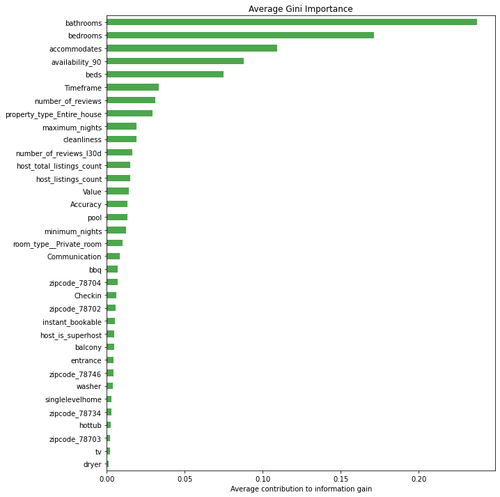

# Predicting Airbnb Listing Prices with Machine Learning and Deep Learning in Austin, TX

Airbnb is an online marketplace that connects people who want to rent out their homes with people who are looking for accomodations in that area. Airbnb currently covers more than 100,000 cities and 220 countries worldwide. The company's name comes from "Air Mattress B&B".
Although Airbnb and some other 3rd party website (e.g., beyondpricing.com) can help in pricing the units, the hosts still need to specify the base daily price, and then, those websites can change the price based on several factors such as seasonaility, day of the week, and any special events (e.g., national holiday,conferences, etc.). 

Many airbnb hosts, especially new and less experiences ones, might set a baseline for their unit which can be higher than the competitive pricing and marketing data which results on missing out on bookings or can be lower which results on leaving profits on the table. Therefore, Airbnb pricing is significantly important specially when competitiveness increases and more rental units become availble on Airbnb. In that case, even small difference in prices can make a big difference. According to the latest marketing data on rental units, competitive pricing can increase the revenue by at least 10%. 
Additionally, it is important to understand what factors (e.g., amenities) are more interesting to the guests, so we can come up with a strategy to attract more guests. 

The goal of this project is to solve this problem by predicting the base price of Airbnb units in Austin, using machine learning algorithms. In the following sections, I'm going to briefly describe the exploratory data analysis (EDA), followed by building several predictive models. 

## Web Scraping
In this project, I scraped the Airbnb website to get the details of all available units in Austin, TX area on March 15, 2021. It's worth to mention that the units URLs were obtained from the available records on Insideairbnb.com website. Then, Selenium and BeautifulSoup were used to scrape the required data from each Url, followed by storing the data in Mongo database.
After scraping the Airbnb website, the details of 10272 units with more than 80 features were obtained. You can find the scraping code in the following directory: SRC/Airbnb_Scraping.ipynb

## EDA Analysis
After loading the data into pandas dataframe format, I performed data-preprocessing on the data and made sure that the formatting and values are reasonable. The following items are a few examples of data preprocessing work that has been done:

    Remove Outliers: Prices (higher than $2,500), unnecessary features (e.g., host ID) 
    Handle Null Values: Remove the rows with null values in price or rating 
    Handle Categorical Data Type: Used one-hot-encoding for features that were categorical (e.g., zip code, pool, bbq)

Therefore, features were chosen only if they were informative and are likely to correlated with the price label. In addition, I removed some of the other features such as longitude and lagitutude as I was mainly using zipcode as the feature.

Final Features that were included in the model are:
* host_is_superhost
* host_listings_count
* host_total_listings_count
* Accommodates
* Number of bedrooms
* Number of beds
* Number of bathrooms
* Minimum number of nights of reservation
* Maximum number of nights of reservation
* Availability of the unit in the next 90 days
* Total number of reviews
* Total number of reviews over the last 30 days
* Whether the unit is instantly bookable or not
* How long the host has joined Airbnb
* Whether the availble room is private or shared
* Whether the entire house is available or not
* Cleanliness score
* Accuracy score
* Communication score
* Checkin score
* Value score
* Available Amenities:
    * Pool                  
    * TV 
    * Washer 
    * Dryer
    * Balcony
    * Private entrance
    * BBQ grill
    * Hot tub
* Single level home
* Five areas in Austin with the following zip codes:
    * 78702
    * 78703
    * 78704
    * 78734
    * 78746

The following figure shows the correlation heat map for some of the important features in the dataset. As can be seen, number of beds, bedrooms, bathrooms, and accomodates have relatively high positive impact on the Airbnb listing price.

## Data Insights
In this section, I explored the data in more details to find any interesting trends/insights.

The following figure shows the histogram of Airbnb listing prices in Austin. The left figure shows the numbers on y-axis in logarithmic scale and the right figure shows the number of units with prices less than $1000. Based on the data, the mean and median listing price of Airbnb units in Austin are $250 and $150, accordingly.

The following figures also show the type of the room and properties available on Airbnb. As can be seen, around 8000 units are entire home, 2000 units are private room, 200 units are shared room, and less than 20 units are hotel rooms. The figure on the right shows more details of the availble houses and apartments in Austin.

| Distribution of Room Type | Distribution of Housing Type |
| --- | --- |
|     |       |

In terms of location of Airbnb units, 18 out of top 20 locations with highest Airbnb units are located close to the downtown area and zilker part where most of the music and film festivals are being held. For people who are not familiar with Austin area, East downtown is one of the most fast growing areas in Austin.

The follwoing presents the median price versus the number of guest accommodated. A linear relationship can be observed between the price and the accommodation.

There are more about 4000 hosts not living in Austin at this moments. There are about 1000 hosts that just used United Stats as the their residency country. In addition, the following cities are the top 5 residency cities of host not living in Austin:
* United States (not explicitly mentioned their residency state)
* Houston
* San Francisco
* New York
* Dallas

Finally, the following figure shows the time hosts joined Airbnb. Airbnb was founded in August 2008. More and more hosts were joined Airbnb from 2008 to 2016. After 2016, there is a declining trend for the number of host joined till it reached its minimum  with less than 300 new host in 2020. Significant decline from 2019 to 2020 can be as a result of covid19. Starting 2021, it looks like more new hosts joined Airbnb to rent out their houses.

## ML WORK
In this section, I build two models using random forest and gradient boosting to predict the listing prices. I used 85% of the data for my training set and 15% for the test set. In addition, I used gridsearch algorithm to tune the hyper-parameters to achieve higher scores.

### Random Forest Method
For the first step, I build a random forest model and fit that to my training dataset. Then, I used gridsearch algorithm to tune my hyperparameters. Finally, I used the following values for my hyper-parameters:
* Max_features: 10
* Max_depth: 15
* number of trees: 1250

By using the random forest module of SKlearn, I got the following results for my training and test dataset. It's worth to mention that the colormap shows the availability of the houses over the next 90 days. Hence, value of 1 means full availability for booking over the next 90 days and 0 means no availability (fully-booked). As can be seen from the following two figures, the model has relatively good accuracy at listing price of less than $800. However, it seems that the model is underpredicting the listing prices more than $800. These units look to have higher availability (less booking) compared to other units. This can be explained in two ways: 1) The hosts have overpriced their units. Hence, travelers prefer to book a less expensive house. 2) Because of higher listing price, it can be normal that few travelers can afford the costs. I took a more detailed look at these houses and will explain my finding in the last part of this section.

| Training dataset | Testing Dataset |
| --- | --- |
|  |  |
| R2 score = 0.7           | R2 score = 0.66      |
| RMSE score = 41          | RMSE score = 121     |

The following figure also shows the permutation importances of the features (average decrease in test score when a feature's values are shuffled)

### Gradient Boost Method
I also build a gradient boost model from sklearn library and trained that based on my training set. I also used gridseach algorithm tune the hyper-parameters. My final hyper-parameters of the gradient boost model are:
* Learning rate: 0.01
* Number of trees: 2000
* Max depth: 4
* min_samples_split: 4

The scores on my test set shows slight improvement compared to the random forest model. In addition, the result look much more promising when I filtered out the houses with more than $800 listing prices.

| Testing dataset | Testing Dataset (filter based on price) |
| --- | --- |
|   |  |
| R2 score = 0.68         | R2 score = 0.7         |
| RMSE score = 118        | RMSE score = 65        |

| Feature Importance in Random Forest | Feature Importance in Gradient Boosting |
| --- | --- |
| |  |

### Features Result in Higher Listing Price

## Future Work

* Include features that are not being included in the amenities part. This task can be done using NLP on house descriptions and/or reviews sections.

* Continously scraping from Austin Airbnb website to include the seasonaility on the listing price.

## Acknowledgments
I greatly appreciate Galvanize instructors, Juliana Duncan and Dan Rupp, for their valuable comments during this project. I would also like to thank Wing Lau for her insight throughout this project.