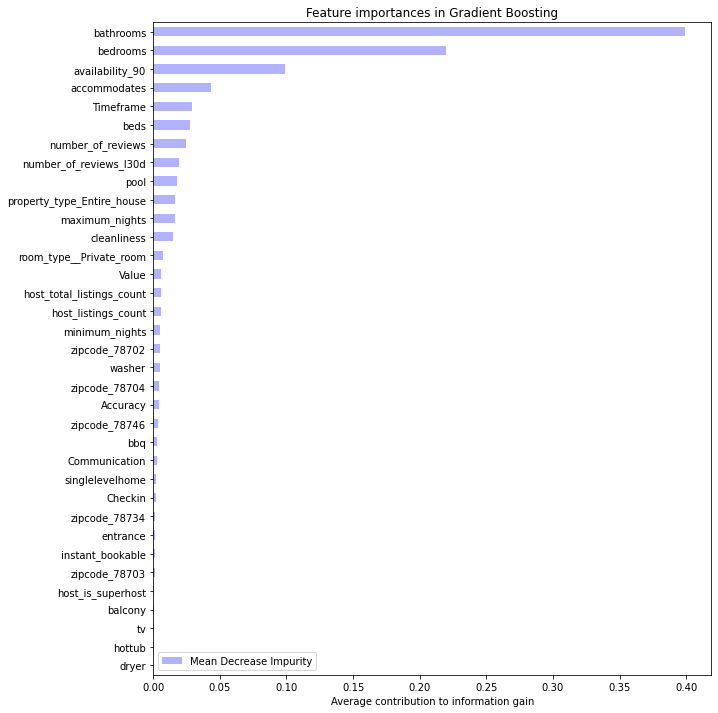

# Predicting Airbnb Listing Prices with Machine Learning and Deep Learning in Austin, TX

Airbnb is an online marketplace that connects people who want to rent out their homes with people who are looking for accomodations in that area. Airbnb currently covers more than 100,000 cities and 220 countries worldwide. The company's name comes from "Air Mattress B&B".
Although Airbnb and some other 3rd party website (e.g., beyondpricing.com) can help in pricing the units, the hosts still need to specify the base daily price, and then, those websites can change the price based on several factors such as seasonaility, day of the week, and any special events (e.g., national holiday,conferences, etc.). 

Many airbnb hosts, especially new and less experiences ones, might set a baseline for their unit which can be higher than the competitive pricing and marketing data which results on missing out on bookings or can be lower which results on leaving profits on the table. Therefore, Airbnb pricing is significantly important specially when competitiveness increases and more rental units become availble on Airbnb. In that case, even small difference in prices can make a big difference. According to the latest marketing data on rental units, competitive pricing can increase the revenue by at least 10%. 
Additionally, it is important to understand what factors (e.g., amenities) are more interesting to the guests, so we can come up with a strategy to attract more guests. 

The goal of this project is to solve this problem by predicting the base price of Airbnb units in Austin, using machine learning algorithms. In the following sections, I'm going to briefly describe the exploratory data analysis (EDA), followed by building several predictive models. 

## Web Scraping
In this project, I scraped the Airbnb website to get the details of all available units in Austin, TX area. It's worth to mention that the units URLs were obtained from the available records on Insideairbnb.com website. Then, Selenium and BeautifulSoup were used to scrape the required data from each Url, followed by storing the data in Mongo database.
After scraping the Airbnb website, the details of 10272 units with more than 80 features were obtained. You can find the scraping code in the following directory: SRC/Airbnb_Scraping.ipynb

## EDA Analysis

### Features
Features are chosen only if they were informative and are likely to correlated with the price label. Therefore, I eliminated features like id, host_id, neighborhood description which did not have an impact on the listing price. In addition, I removed some of the other features such as longitude and lagitutude as I was mainly using zipcode as the feature.

* Label

* Continous features

* Categorical features:

* Text features:

* Date features: 

Final Features that were included in the model are:
* host_is_superhost
* host_listings_count
* host_total_listings_count
* Accommodates
* Number of bedrooms
* Number of beds
* Number of bathrooms
* Minimum number of nights of reservation
* Maximum number of nights of reservation
* Availability of the unit in the next 90 days
* Total number of reviews
* Total number of reviews over the last 30 days
* Whether the unit is instantly bookable or not
* How long the host has joined Airbnb
* Whether the availble room is private or shared
* Whether the entire house is available or not
* Cleanliness score
* Accuracy score
* Communication score
* Checkin score
* Value score
* Available Amenities:
    * Pool 
    * TV 
    * Washer 
    * Dryer
    * Balcony
    * Private entrance
    * BBQ grill
    * Hot tub
* Single level home
* Five areas in Austin with the following zip codes:
    * 78702
    * 78703
    * 78704
    * 78734
    * 78746

The following figure shows the correlation heat map for some of the important features in the dataset. As can be seen, number of beds, bedrooms, bathrooms, and accomodates have relatively high positive impact on the Airbnb listing price.

## Data Insights
In this section, I explored the data in more details to get more understanding of the correlation

In terms of location of Airbnb units, 18 out of 20 locations with highest Airbnb units are located close to the downtown area and zilker part where most of the music and film festivals are being held. For people who are not familiar with Austin area, East downtown is one of the most fast growing areas in Austin.

## ML WORK

### Random Forest Method

daswsfdgdf

| Training dataset | Testing Dataset |
| --- | --- |
|  |  |
| R2 score = 0.7           | R2 score = 0.66      |
| RMSE score = 41          | RMSE score = 121     |

### Gradient Boost Method

| Testing dataset | Testing Dataset (filter based on price) |
| --- | --- |
|  |  |
| R2 score = 0.68         | R2 score = 0.7         |
| RMSE score = 118        | RMSE score = 65        |

| Feature Importance in Random Forest | Feature Importance in Gradient Boosting |
| --- | --- |
| |  |

## Future Work

* Include features that are not being included in the amenities part. This task can be done using NLP on house descriptions and/or reviews sections.

* Continously scraping from Austin Airbnb website to include the seasonaility on the listing price.

## Acknowledgments
I greatly appreciate Galvanize instructors, Juliana Duncan and Dan Rupp, for their valuable comments during this project. I would also like to thank Wing Lau for her insight throughout this project.